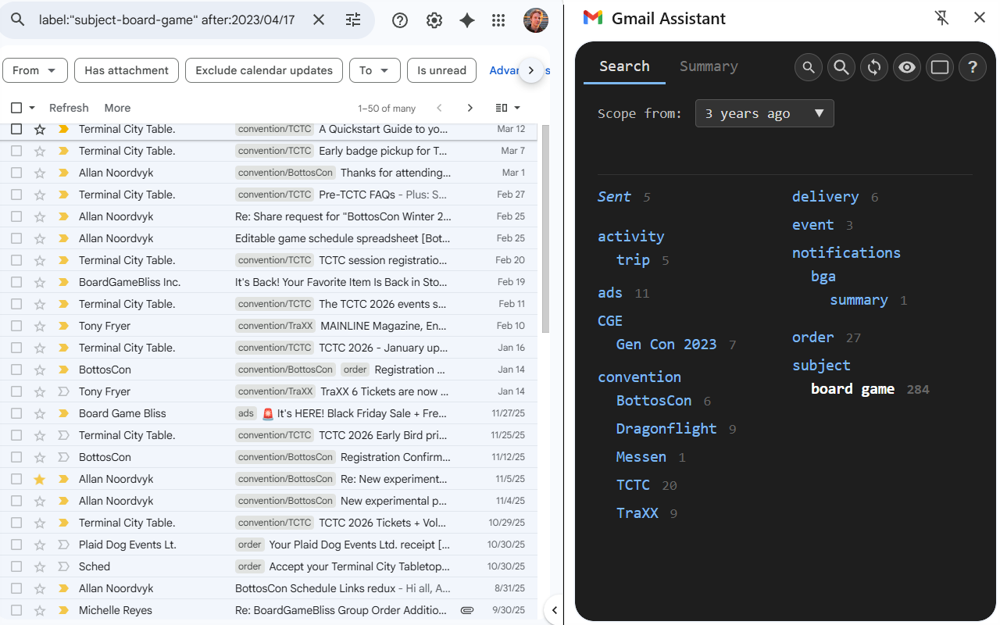
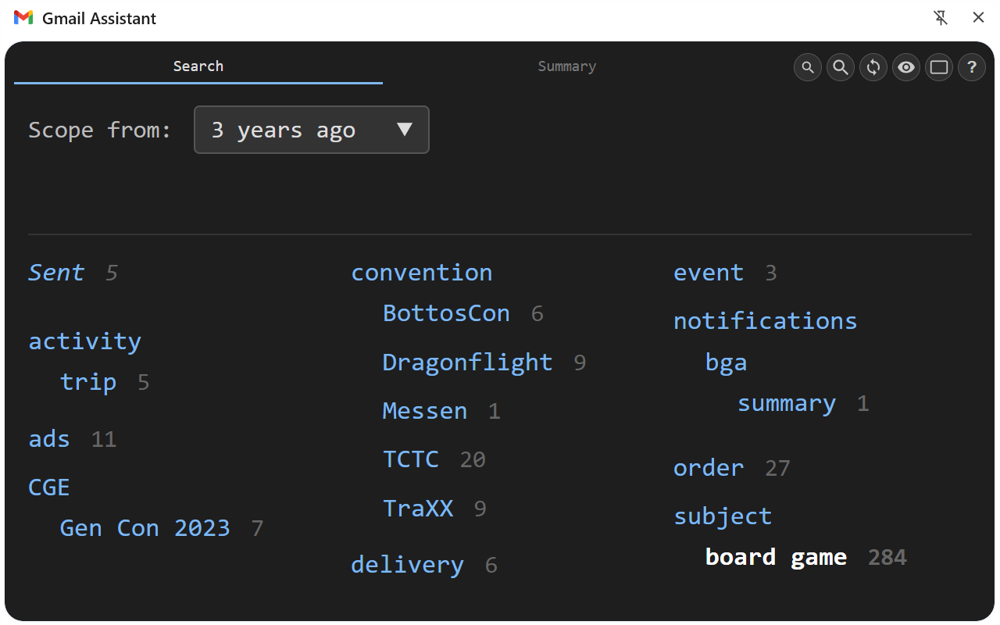
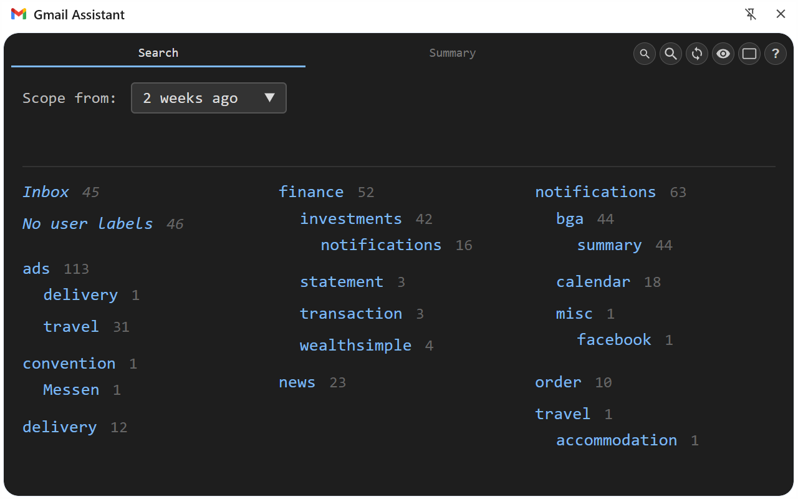
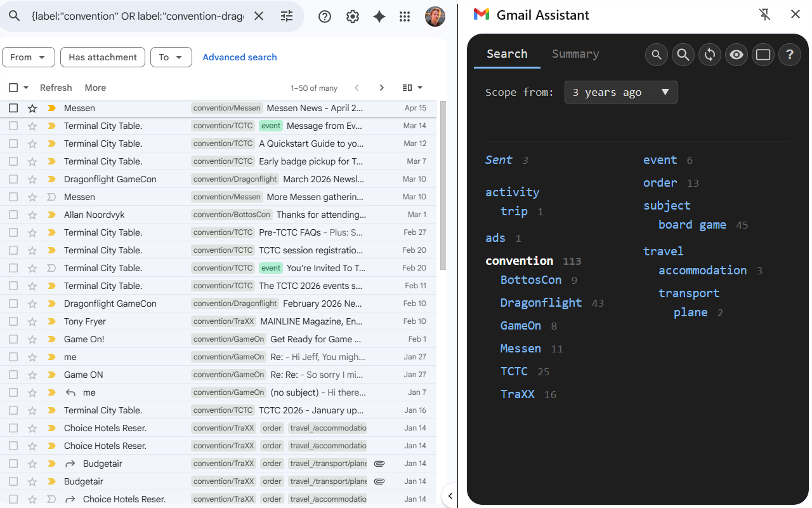

[Home](../..) | [Gmail](.) | [Privacy](privacy) | [Development](../development)

---

A side panel extension for [Gmail](https://mail.google.com) that provides quick label-based filtering and navigation. Browse your labels in a multi-column layout, narrow by location and time scope, and jump to filtered views with one click.

### Label browser

All your Gmail labels laid out in a multi-column grid. User labels appear alongside system labels (Inbox, Sent, Starred, Important), grouped by parent. Click a label to navigate the Gmail tab to that label's view; click again to deselect.

### Dynamic filtering

A background cache builds progressively on first use, indexing the labels that appear on each message. Once the cache is warm, selecting a label instantly narrows the label grid to only those that appear together with it — the co-label counts update live so you can see which labels overlap. Subsequent selections are instant.

### Time scope

Narrow results to messages received within a time range (1 week to 5 years, or any time). Scope combines with label selection — pick a label and a time range to jump straight to the filtered Gmail view.

### Include sub-labels

When you select a parent label, its children are included by default — so selecting `Work` shows messages from `Work/Team`, `Work/Clients`, etc. Toggle this off in display settings to match only the selected label.

### Features

- **Label grid**: user labels and system labels in a configurable multi-column layout
- **Click-to-filter**: one click navigates the Gmail tab to the label view
- **Time scope**: 1w / 2w / 1mo / 3mo / 6mo / 1y / 2y / 5y / any
- **Include sub-labels**: parent-label selection includes descendants (configurable)
- **System labels**: Inbox, Sent, Starred, Important shown alongside user labels (Starred/Important hidden by default, toggle in settings)
- **Live counts**: message counts next to each label, updated as the cache builds (can be hidden)
- **Co-label intersections**: when a label is selected, counts show how many of its messages also carry each other label
- **Background cache**: progressive build on first use, incremental refresh afterwards; cached in IndexedDB
- **Cache reset**: one-click refresh button rebuilds the cache from scratch
- **Multi-account**: detects Gmail account path (`/mail/u/0/`, `/mail/u/1/`, …) and maintains a separate cache per account
- **Return to inbox**: optionally navigates Gmail back to Inbox when the side panel closes

### Standard features

- **Auto-hide**: never / when leaving Gmail
- **Per-context zoom**: zoom level saved independently per context
- **Keyboard shortcut**: configurable via `chrome://extensions/shortcuts`
- **Multi-window**: independent state per Chrome window (each side panel tracks its own selection)
- **Built-in help page**: click **?** for a detailed guide
